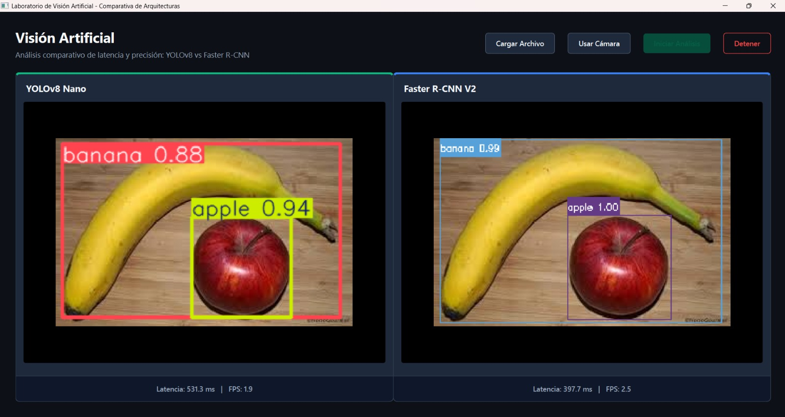
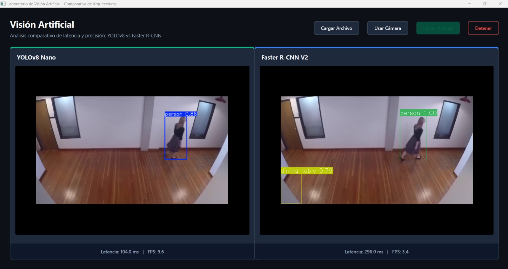

# Detección de Objetos: Faster R-CNN vs YOLOv8

Comparación experimental entre dos enfoques de detección de objetos en visión artificial: **Faster R-CNN** (modelo de dos etapas) y **YOLOv8n** (modelo de una sola etapa), evaluados sobre imágenes estáticas y video en tiempo real, ejecutados sobre CPU.

Proyecto desarrollado como Actividad 06 del curso de Visión Artificial — Escuela Profesional de Ingeniería de Sistemas, Universidad Nacional del Altiplano (Puno, Perú).

## Características

- Detección de objetos sobre imágenes estáticas con Faster R-CNN (ResNet-50-FPN) y YOLOv8n
- Procesamiento de video en tiempo real con ambos modelos
- Interfaz gráfica unificada (PyQt6) para comparar resultados de ambos modelos en paralelo
- Generación de gráficos comparativos de tiempo de inferencia y FPS
- Utilidad de diagnóstico para detección de cámaras disponibles

## Tecnologías

Python · PyTorch · TorchVision · Ultralytics YOLOv8 · OpenCV · PyQt6

## Estructura del proyecto

| Módulo | Descripción |
| --- | --- |
| `rcnn_detection.py` | Detección con Faster R-CNN (ResNet-50-FPN), imágenes y video |
| `yolo_detection.py` | Detección con YOLOv8n, imágenes y video |
| `compare_results.py` | Recolección y visualización de métricas comparativas |
| `test_all_cameras.py` | Diagnóstico de dispositivos de captura de video disponibles |
| `main_gui.py` | Interfaz gráfica (PyQt6) con comparación en paralelo |

## Instalación

```bash
git clone <url-del-repositorio>
cd <nombre-del-repositorio>
pip install torch torchvision ultralytics opencv-python PyQt6
```

## Uso

```bash
# Detección sobre imagen estática
python rcnn_detection.py --image ruta/a/imagen.jpg
python yolo_detection.py --image ruta/a/imagen.jpg

# Procesamiento de video en tiempo real
python rcnn_detection.py --video 0
python yolo_detection.py --video 0

# Interfaz gráfica comparativa
python main_gui.py
```

## Resultados

Pruebas ejecutadas sobre CPU, sin aceleración GPU, con umbral de confianza de 0.5 para ambos modelos.

| Métrica | YOLOv8n | Faster R-CNN | Diferencia |
| --- | --- | --- | --- |
| Tiempo de inferencia (imagen) | 192.00 ms | 1,951.79 ms | R-CNN ~10.2× más lento |
| Velocidad de video (FPS) | 10.37 | 0.52 | YOLO ~19.9× más rápido |
| Categorías COCO soportadas | 80 | 91 | R-CNN +11 categorías |

**Conclusión principal:** YOLOv8n es significativamente más adecuado para aplicaciones en tiempo real, mientras que Faster R-CNN ofrece mayor precisión de localización cuando la latencia no es crítica, especialmente con hardware GPU.

### Detección sobre imagen estática



*Faster R-CNN asignó mayor confianza a los objetos (manzana: 1.00, plátano: 0.99) frente a YOLOv8 (0.94 y 0.88), mostrando mayor precisión de detección a costa de más tiempo de cómputo.*

### Detección sobre video en tiempo real



*YOLOv8 detectó a la persona en 104 ms (9.6 FPS); Faster R-CNN, con 296 ms (3.4 FPS), identificó además un objeto adicional ("dining table"), a costa de mayor latencia.*

## Dataset

Ambos modelos se evaluaron sobre **COCO** (Common Objects in Context).

## Trabajo futuro

- Evaluar variantes más grandes de YOLOv8 (m, l, x) y Mask R-CNN sobre GPU
- Incorporar métricas de precisión media (mAP@0.5 y mAP@0.5:0.95)

## Autores

- Quispe Ticona, Angel Pedro
- Angles Quispe, Carlos Mauricio
- Mamani Turpo, Elfer
- Huanca Chambi, Cristian Brayan

**Curso:** Visión Artificial — **Docente:** Fernandez Chambi, Mayenka — Semestre X, Grupo B

## Referencias

- Girshick et al. (2014). *Rich feature hierarchies for accurate object detection and semantic segmentation.* CVPR.
- He et al. (2016). *Deep residual learning for image recognition.* CVPR.
- Jocher, Chaurasia & Qiu (2023). *Ultralytics YOLO (v8.0.0)* [Software]. https://github.com/ultralytics/ultralytics
- Lin et al. (2014). *Microsoft COCO: Common objects in context.* ECCV.
- Lin et al. (2017). *Feature pyramid networks for object detection.* CVPR.
- Redmon et al. (2016). *You only look once: Unified, real-time object detection.* CVPR.
- Ren et al. (2015). *Faster R-CNN: Towards real-time object detection with region proposal networks.* NeurIPS.
